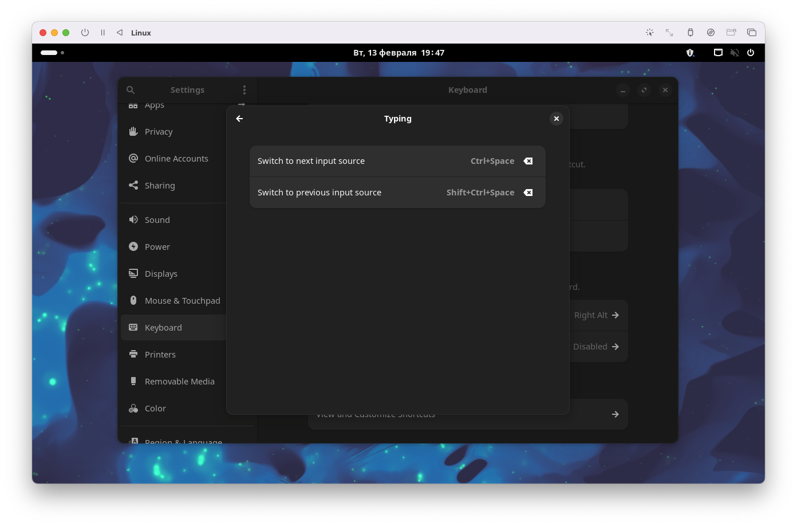
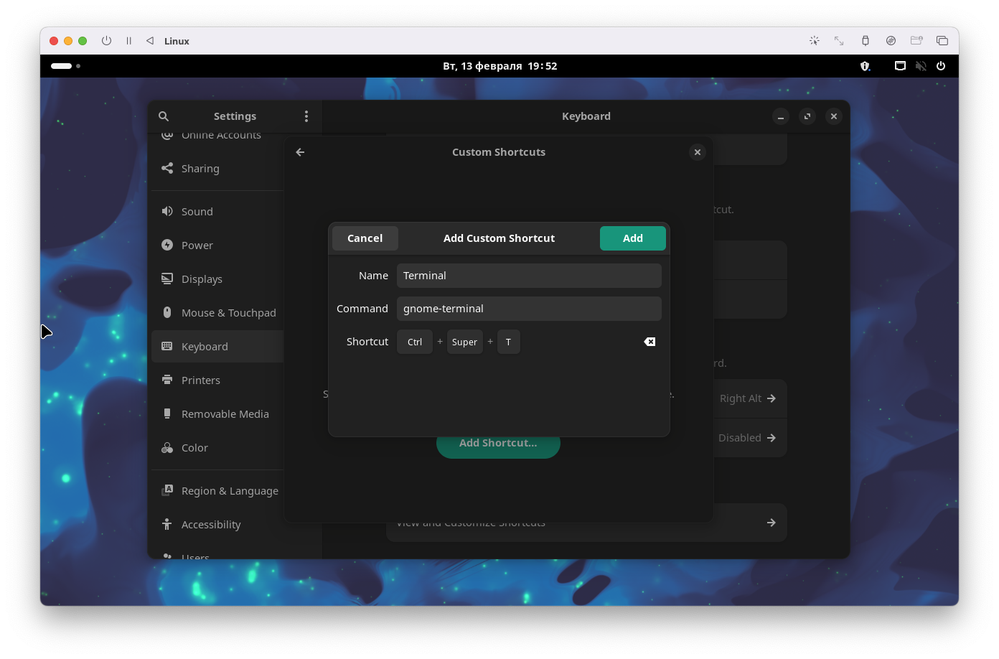
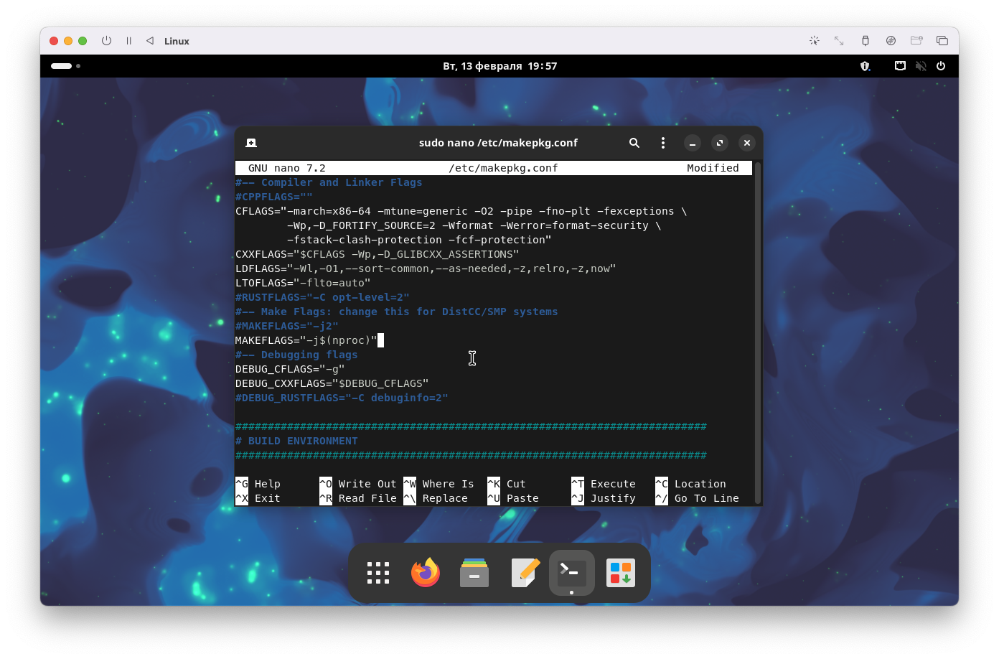
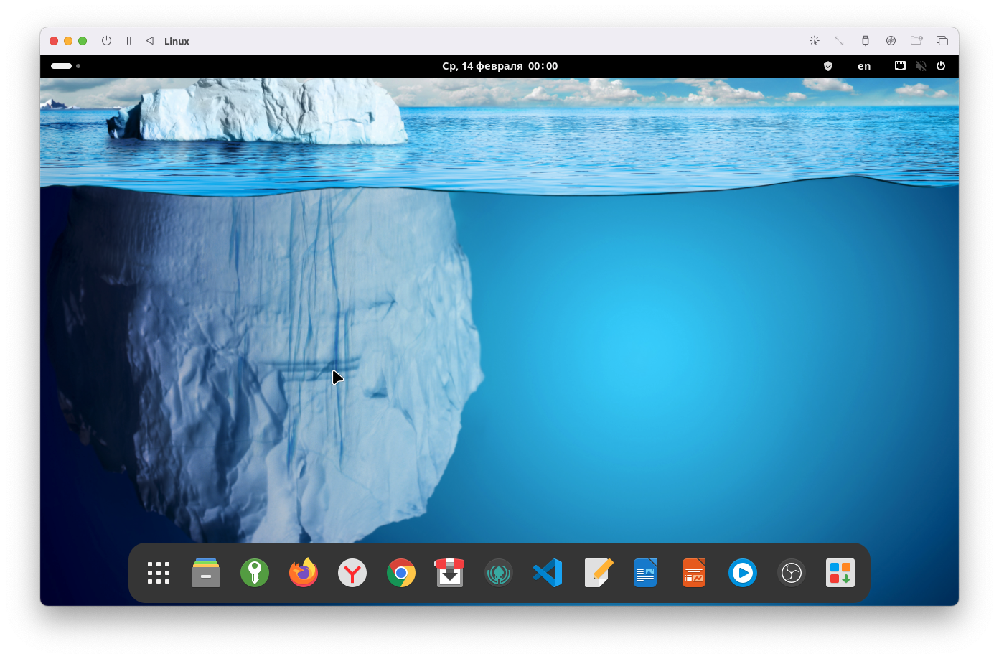

### 1. Changing keyboard shortcuts and set custom shortcut




### 2. Disabling root login for security purposes

```su root```  
```
echo root:$(openssl rand -base64 64) && echo root:$(openssl rand -base64 64) | chpasswd && passwd -l root && exit
```

### 3. Enable all kernels to build package

```sudo nano /etc/makepkg.conf```  
```MAKEFLAGS="-j$(nproc)"```


### 4. Updating packages

```sudo pacman -Suyy --noconfirm```

### 5. Oh My Zsh

```
sh -c "$(curl -fsSL https://raw.githubusercontent.com/ohmyzsh/ohmyzsh/master/tools/install.sh)"
```  
```reboot```

### 6. Enable the firewall (UFW)

```sudo ufw enable```

### 7. AUR

```
sudo pacman -S --noconfirm base-devel && git clone https://aur.archlinux.org/yay.git && cd yay && makepkg -si --noconfirm && cd .. && rm -rf yay && sudo pacman -Rs --noconfirm go
```

### 8. Installing the necessary programs (you can change the list if youwant)

```
yay -S --noconfirm libreoffice-fresh-ru vlc qt5-wayland qt6-wayland keepassxc nodejs wlroots xdg-desktop-portal-wlr obs-studio amberol transmission-qt gparted gitkraken visual-studio-code-bin tree neovim && flatpak install flathub com.google.Chrome ru.yandex.Browser
```  
```reboot```

### 9. Fixs

##### Fix Amberol
```sudo nano .config/mimeapps.list```  
[Default Applications]  
```inode/directory=org.gnome.Nautilus.desktop```

##### Fix AirPods Pro v1 connection
```sudo nano /etc/bluetooth/main.conf```  
```ControllerMode = bredr```  
```sudo systemctl restart bluetooth.service```  

##### Disable default Night light
```
sudo -u gdm dbus-launch --exit-with-session gsettings set org.gnome.settings-daemon.plugins.color night-light-enabled false
```

### 10. Uninstalling programs

```
sudo pacman -Rscun --noconfirm totem fragments lollypop quadrapassel iagno gnome-mines gnome-chess
```

<hr>

